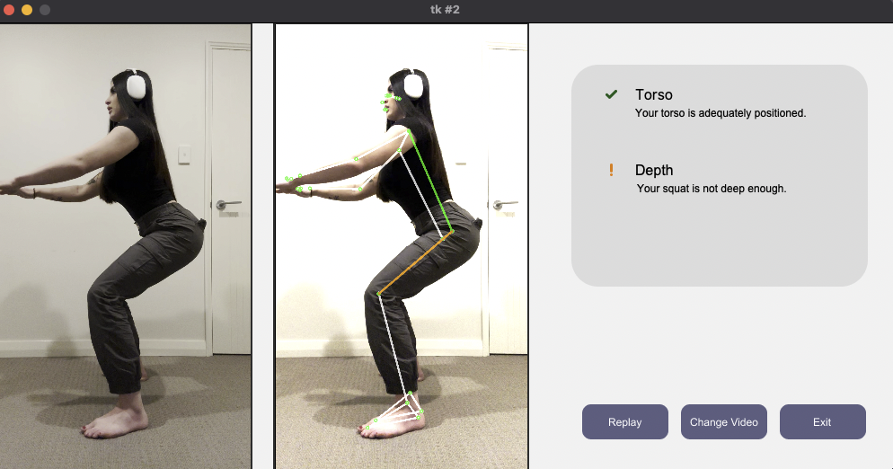
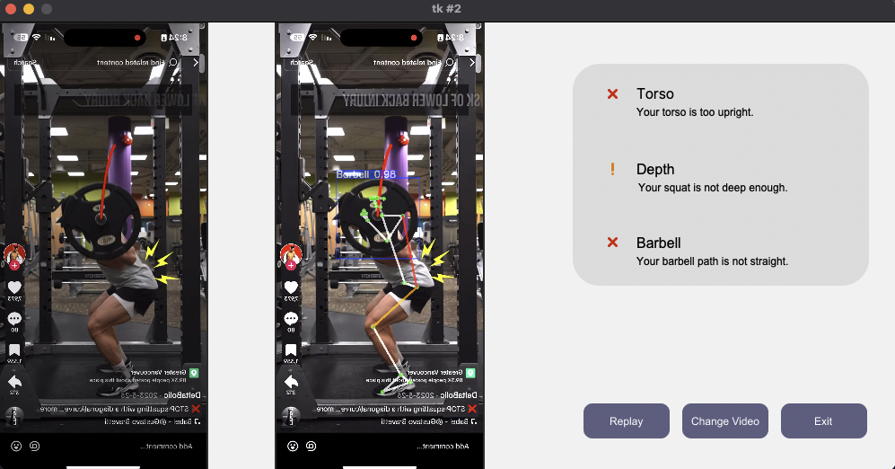

# Reform

## Table of Contents
- [Introduction](#introduction)
- [Features](#features)
- [Installation](#installation)
- [Usage](#usage)
- [Program Structure](#program-structure)
- [Contributing](#contributing)
- [Screenshots](#screenshots)
- [License](#license)

## Introduction
Reform evaluates an individual's form during strength-training exercises by analysing video inputs and providing real-time visual feedback. The program utilises the `MediaPipe Pose Landmarker` task to identify key body landmarks and applies vector geometry and trigonometry to detect any form issues. Additionally, it uses a custom-trained `YOLO-v3` object detection model to identify free weights.

Currently, the program analyses two exercises: **squats** and **deadlifts**. The analysis is based on widely recognized standards for the **conventional** execution of these exercises and does not account for variations such as sumo styles or close-foot stances. **The depth and accuracy of the analysis are subject to the capabilities of the MediaPipe pose estimation models.**

## Features
- **Real-Time Analysis and Feedback**: Provides immediate feedback to help users precisely identify and correct form discrepancies.
- **Landmark Detection**: Detects key body parts using the MediaPipe Pose Landmarker to monitor movements and positions.
- **Object Detection**: Identifies free weights in the video using a custom-trained YOLO-v3 model to enable relevant analyses, such as barbell path tracking.
- **Multi-View Support**: Analyzes both front and side views of exercises to provide comprehensive feedback on form.
- **Graphical User Interface (GUI)**: Offers an easy-to-use interface for selecting exercises and input videos, and for displaying detailed analysis results in real-time.

## Installation
1. Clone the repository:
    ```bash
    git clone https://github.com/mxlodyk/Taxi.git
    ```
2. Navigate to the project directory:
    ```bash
    cd Taxi
    ```
3. Install the required dependencies:
    ```bash
    pip install -r requirements.txt
    ```

### Prerequisites
- Python 3.10.x
- OpenCV-Python
- NumPy
- MediaPipe
- Ultralytics
- Pillow
- Tkinter

## Usage
1. Launch the program:
    Run the main script to start the program:
    ```bash
    python3 main.py
    ```
2. Select exercise and video:
    

## Program Structure
- `main.py`: The entry point for the program. It handles user input and controls the program flow.
- `analysis.py`: Contains the `Analysis` class and subclasses (`Squat`, `Deadlift`) for analysing different exercises and their forms.
- `gui.py`: Defines the GUI interface for the user to select exercises and videos.
- `helpers.py`: Includes utility functions for angle calculations, coordinate conversions, and other supporting tasks.
- `errors.py`: Contains custom error handling.

## Contributing
Contributions are welcome! If you'd like to improve the program or fix any issues, please:
1. Fork the repository.
2. Create a new branch (`git checkout -b feature/your-feature`).
3. Commit your changes (`git commit -m 'Add some feature'`).
4. Push to the branch (`git push origin feature/your-feature`).
5. Open a Pull Request.

## Screenshots





## License
This project is licensed under the MIT License - see the [LICENSE](LICENSE) file for details.
